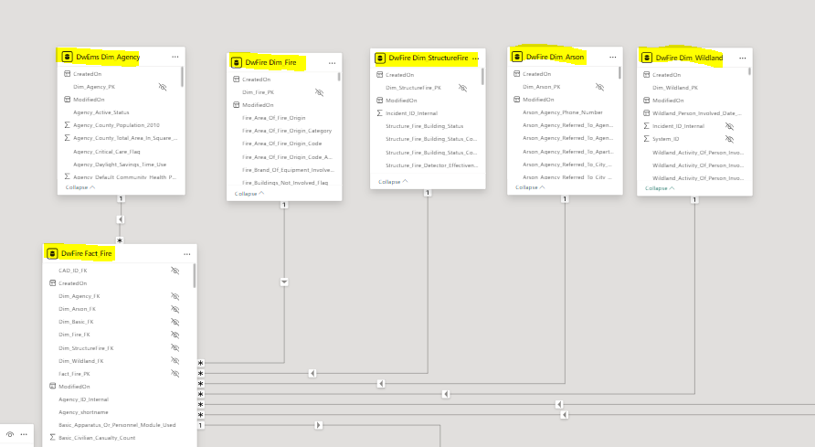
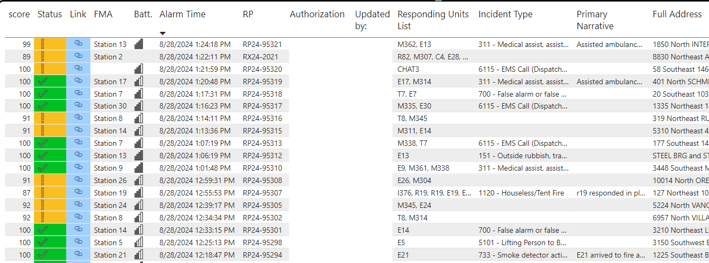

# Overview and layout for NFIRS data tables

We can use the [provided documentation](./static/EliteDataMartGuide.pdf) from ImageTrend to reverse-engineer the star schema.  An extracted raw version can be found [here](./static/raw_query_nfirs.sql).

The below is a better organized version of that query and is a good starting point for understanding how the tables in DataMart are related.  We can iteratively chunk this query and group our tables together.  Before we start, we can ensure that our [dataflow](Dataflow.md) is pulling in the needed tables.

```sql
CREATE VIEW [dbo].[DSV_Elite_Fire_View] AS SELECT Fact_Fire.*

FROM [DwFire].[Fact_Fire]

LEFT JOIN [DwEms].[Dim_Agency] AS [Dim_Agency] ON [Fact_Fire].[Dim_Agency_FK] = [Dim_Agency].[Dim_Agency_PK]

LEFT JOIN [DwFire].[Dim_Fire] AS [Dim_Fire] ON [Fact_Fire].[Dim_Fire_FK] = [Dim_Fire].[Dim_Fire_PK]
LEFT JOIN [DwFire].[Dim_StructureFire] AS [Dim_StructureFire] ON [Fact_Fire].[Dim_StructureFire_FK] = [Dim_StructureFire].[Dim_StructureFire_PK]
LEFT JOIN [DwFire].[Dim_Arson] AS [Dim_Arson] ON [Fact_Fire].[Dim_Arson_FK] = [Dim_Arson].[Dim_Arson_PK]
LEFT JOIN [DwFire].[Dim_Wildland] AS [Dim_Wildland] ON [Fact_Fire].[Dim_Wildland_FK] = [Dim_Wildland].[Dim_Wildland_PK]

---- BASIC

LEFT JOIN [DwFire].[Dim_Basic] AS [Dim_Basic] ON [Fact_Fire].[Dim_Basic_FK] = [Dim_Basic].[Dim_Basic_PK]
LEFT JOIN [DwFire].[Bridge_Basic_BasicNarrativeOther] AS [Bridge_Basic_BasicNarrativeOther] ON [Dim_Basic].[Dim_Basic_PK] = [Bridge_Basic_BasicNarrativeOther].[Dim_Basic_PK]
LEFT JOIN [DwFire].[Dim_BasicNarrativeOther] AS [Dim_BasicNarrativeOther] ON [Bridge_Basic_BasicNarrativeOther].[Dim_BasicNarrativeOther_PK] = [Dim_BasicNarrativeOther].[Dim_BasicNarrativeOther_PK]

LEFT JOIN [DwFire].[Bridge_Basic_BasicPersonInvolved] AS [Bridge_Basic_BasicPersonInvolved] ON [Dim_Basic].[Dim_Basic_PK] = [Bridge_Basic_BasicPersonInvolved].[Dim_Basic_PK]
LEFT JOIN [DwFire].[Dim_BasicPersonInvolved] AS [Dim_BasicPersonInvolved] ON [Bridge_Basic_BasicPersonInvolved].[Dim_BasicPersonInvolved_PK] = [Dim_BasicPersonInvolved].[Dim_BasicPersonInvolved_PK]

---- FIRE CAD

FULL JOIN [DwFire].[Dim_Fire_CAD] AS [Dim_Fire_CAD] ON [Fact_Fire].[CAD_ID_FK] = [Dim_Fire_CAD].[Dim_Fire_CAD_PK]
LEFT JOIN [DwFire].[Bridge_FireCAD_Apparatus] AS [Bridge_FireCAD_Apparatus] ON [Dim_Fire_CAD].[Dim_Fire_CAD_PK] = [Bridge_FireCAD_Apparatus].[Dim_Fire_CAD_PK]
LEFT JOIN [DwFire].[Dim_Fire_CAD_Apparatus] AS [Dim_Fire_CAD_Apparatus] ON [Bridge_FireCAD_Apparatus].[Bridge_FireCAD_Apparatus_PK] = [Dim_Fire_CAD_Apparatus].[Dim_Fire_CAD_Apparatus_PK]

--- Apparatus Resources / Personnel

LEFT JOIN [DwFire].[Bridge_Fire_ApparatusResources] AS [Bridge_Fire_ApparatusResources] ON [Fact_Fire].[Fact_Fire_PK] = [Bridge_Fire_ApparatusResources].[Fact_Fire_PK]
LEFT JOIN [DwFire].[Dim_ApparatusResources] AS [Dim_ApparatusResources] ON [Bridge_Fire_ApparatusResources].[Dim_ApparatusResources_PK] = [Dim_ApparatusResources].[Dim_ApparatusResources_PK]
LEFT JOIN [DwFire].[Bridge_ApparatusResources_ApparatusPersonnel] AS [Bridge_ApparatusResources_ApparatusPersonnel] ON [Dim_ApparatusResources].[Dim_ApparatusResources_PK] = [Bridge_ApparatusResources_ApparatusPersonnel].[Dim_ApparatusResources_PK]
LEFT JOIN [DwFire].[Dim_ApparatusPersonnel] AS [Dim_ApparatusPersonnel] ON [Bridge_ApparatusResources_ApparatusPersonnel].[Dim_ApparatusPersonnel_PK] = [Dim_ApparatusPersonnel].[Dim_ApparatusPersonnel_PK]

--- CASUALTIES

LEFT JOIN [DwFire].[Bridge_Fire_CivilianCasualty] AS [Bridge_Fire_CivilianCasualty] ON [Fact_Fire].[Fact_Fire_PK] = [Bridge_Fire_CivilianCasualty].[Fact_Fire_PK]
LEFT JOIN [DwFire].[Dim_CivilianCasualty] AS [Dim_CivilianCasualty] ON [Bridge_Fire_CivilianCasualty].[Dim_CivilianCasualty_PK] = [Dim_CivilianCasualty].[Dim_CivilianCasualty_PK]

LEFT JOIN [DwFire].[Bridge_Fire_FireServiceCasualty] AS [Bridge_Fire_FireServiceCasualty] ON [Fact_Fire].[Fact_Fire_PK] = [Bridge_Fire_FireServiceCasualty].[Fact_Fire_PK]
LEFT JOIN [DwFire].[Dim_FireServiceCasualty] AS [Dim_FireServiceCasualty] ON [Bridge_Fire_FireServiceCasualty].[Dim_FireServiceCasualty_PK] = [Dim_FireServiceCasualty].[Dim_FireServiceCasualty_PK]

LEFT JOIN [DwFire].[Bridge_FireServiceCasualty_FireServiceCasualtyProtectiveEquipment] AS [Bridge_FireServiceCasualty_FireServiceCasualtyProtectiveEquipment] ON [Dim_FireServiceCasualty].[Dim_FireServiceCasualty_PK] = [Bridge_FireServiceCasualty_FireServiceCasualtyProtectiveEquipment].[Dim_FireServiceCasualty_PK]
LEFT JOIN [DwFire].[Dim_FireServiceCasualtyProtectiveEquipment] AS [Dim_FireServiceCasualtyProtectiveEquipment] ON [Bridge_FireServiceCasualty_FireServiceCasualtyProtectiveEquipment].[Dim_FireServiceCasualtyProtectiveEquipment_PK] = [Dim_FireServiceCasualtyProtectiveEquipment].[Dim_FireServiceCasualtyProtectiveEquipment_PK]

---- HAZMAT

LEFT JOIN [DwFire].[Bridge_Fire_HazMat] AS [Bridge_Fire_HazMat] ON [Fact_Fire].[Fact_Fire_PK] = [Bridge_Fire_HazMat].[Fact_Fire_PK]
LEFT JOIN [DwFire].[Dim_HazMat] AS [Dim_HazMat] ON [Bridge_Fire_HazMat].[Dim_HazMat_PK] = [Dim_HazMat].[Dim_HazMat_PK]
LEFT JOIN [DwFire].[Bridge_HazMat_HazMatResponsibleParty] AS [Bridge_HazMat_HazMatResponsibleParty] ON [Dim_HazMat].[Dim_HazMat_PK] = [Bridge_HazMat_HazMatResponsibleParty].[Dim_HazMat_PK]
LEFT JOIN [DwFire].[Dim_HazMatResponsibleParty] AS [Dim_HazMatResponsibleParty] ON [Bridge_HazMat_HazMatResponsibleParty].[Dim_HazMatResponsibleParty_PK] = [Dim_HazMatResponsibleParty].[Dim_HazMatResponsibleParty_PK]
LEFT JOIN [DwFire].[Bridge_Fire_HazMatDetail] AS [Bridge_Fire_HazMatDetail] ON [Fact_Fire].[Fact_Fire_PK] = [Bridge_Fire_HazMatDetail].[Fact_Fire_PK]
LEFT JOIN [DwFire].[Dim_HazMatDetail] AS [Dim_HazMatDetail] ON [Bridge_Fire_HazMatDetail].[Dim_HazMatDetail_PK] = [Dim_HazMatDetail].[Dim_HazMatDetail_PK]

--- ET CETERA

LEFT JOIN [DwFire].[Bridge_Fire_ArsonJuvenileArsonist] AS [Bridge_Fire_ArsonJuvenileArsonist] ON [Fact_Fire].[Fact_Fire_PK] = [Bridge_Fire_ArsonJuvenileArsonist].[Fact_Fire_PK]
LEFT JOIN [DwFire].[Dim_ArsonJuvenileArsonist] AS [Dim_ArsonJuvenileArsonist] ON [Bridge_Fire_ArsonJuvenileArsonist].[Dim_ArsonJuvenileArsonist_PK] = [Dim_ArsonJuvenileArsonist].[Dim_ArsonJuvenileArsonist_PK]

LEFT JOIN [DwFire].[Bridge_Fire_EMS] AS [Bridge_Fire_EMS] ON [Fact_Fire].[Fact_Fire_PK] = [Bridge_Fire_EMS].[Fact_Fire_PK]
LEFT JOIN [DwFire].[Dim_EMS] AS [Dim_EMS] ON [Bridge_Fire_EMS].[Dim_EMS_PK] = [Dim_EMS].[Dim_EMS_PK]

LEFT JOIN [DwFire].[Bridge_Fire_FireAttachment] AS [Bridge_Fire_FireAttachment] ON [Fact_Fire].[Fact_Fire_PK] = [Bridge_Fire_FireAttachment].[Fact_Fire_PK]
LEFT JOIN [DwFire].[Dim_FireAttachment] AS [Dim_FireAttachment] ON [Bridge_Fire_FireAttachment].[Dim_FireAttachment_PK] = [Dim_FireAttachment].[Dim_FireAttachment_PK]

---

LEFT JOIN [dbo].[DSV_Dim_Incident_Date_Fire] AS [DSV_Dim_Incident_Date_Fire] ON [Fact_Fire].[Dim_Date_Fire_PK] = [DSV_Dim_Incident_Date_Fire].[Dim_Incident_Date_Fire_FK]
LEFT JOIN [dbo].[DSV_Dim_Incident_Time_Of_Day_Fire] AS [DSV_Dim_Incident_Time_Of_Day_Fire] ON [Fact_Fire].[Dim_TimeOfDay_Fire_PK] = [DSV_Dim_Incident_Time_Of_Day_Fire].[Dim_Incident_Time_Of_Day_Fire_PK]

GO
```

For example, the first few tables have simple relationships and are connected like this:


1. **Fact_Fire to Dim_Agency**
   - `Fact_Fire` joins to `Dim_Agency` on `Dim_Agency_FK`
   - **Cardinality**: **Many-to-One**
   - **Direction**: **One-way**. The filter should travel from `Dim_Agency` to `Fact_Fire`. This allows you to filter fact data based on agency attributes.


2. **Fact_Fire to Dim_Fire**
   - `Fact_Fire` joins to `Dim_Fire` on `Dim_Fire_FK`
   - **Cardinality**: **Many-to-One**
   - **Direction**: **One-way**. The filter should travel from `Dim_Fire` to `Fact_Fire` for similar reasons as above, allowing filtering of fact data based on fire dimensions.

3. **Fact_Fire to Dim_StructureFire**
   - `Fact_Fire` joins to `Dim_StructureFire` on `Dim_StructureFire_FK`
   - **Cardinality**: **Many-to-One**
   - **Direction**: **One-way**. The filter should travel from `Dim_StructureFire` to `Fact_Fire`.

4. **Fact_Fire to Dim_Arson**
   - `Fact_Fire` joins to `Dim_Arson` on `Dim_Arson_FK`
   - **Cardinality**: **Many-to-One**
   - **Direction**: **One-way**. The filter should travel from `Dim_Arson` to `Fact_Fire`.

5. **Fact_Fire to Dim_Wildland**
   - `Fact_Fire` joins to `Dim_Wildland` on `Dim_Wildland_FK`
   - **Cardinality**: **Many-to-One**
   - **Direction**: **One-way**. The filter should travel from `Dim_Wildland` to `Fact_Fire`.

**Filter Direction**: Filters should generally flow **one-way** from the dimension tables (`Dim_Agency`, `Dim_Fire`, `Dim_StructureFire`, `Dim_Arson`, `Dim_Wildland`) to the fact table (`Fact_Fire`). This setup ensures that when you use dimension attributes to slice and dice your data, the filters propagate correctly to the fact table, allowing you to analyze the data at various levels of granularity.

Once setup - it should look like this:




## Bulding our first Report

In order to test our assumptions and slowly iterate over the build-out, we can create sample a report with a table view.  Each row should correspond to one "Incident Report"

### Reverse-engineering ImageTrend's URL scheme

Becuase ImageTrend Elite is a SaaS product with which we interface entirely via the web - we can easily re-create the dynamic URL needed to navigate to any Incident Report if we closely strutinize the URL of any given report.

We can then create a computed-column for the URL of the report and provide that as a click-able link in our PowerBI reports.

```DAX
Link to Elite Web = "https://portland.imagetrendelite.com/Elite/Organizationportland/Agencyportlandfi/FireRunForm#/Incident" & 'DwFire Fact_Fire'[Incident_ID_Internal] & "/Form" & 'DwFire Fact_Fire'[Basic_Incident_Form_Number]
```

#TODO - break down further in to each variable as this is for Portland only.

## Report view so far



As we slowly build, we can include information from each module to "stitch" together the entire report.

In addition to module data, we can use ImageTrend's internal application data to further provide context.  For example, we can conditionally format off of `Basic_Incident_Validity_Score` and/or `Basic_Incident_Status` to show if a given report has been completed.

## Troubleshooting

WIth only the report we've made so far we now have an at-a-glance view of our bulk reports. This allows us to quickly assess training, implementation and/or reporting issues all at once!

For instance, reports with Engine 3 and Truck 3 do not include an FMA or `Primary Station Name` while all other EOPS units do (not visible in the above example).  In order to problem-solve this inconsistency, we may need to:

 - Scrutinize our ImageTrend configuration
 - Review and/or modify our user-interface for that report
 - Ensure CAD files consistently report that item
 - Speak with crews about charting habits and knowledge of policy
 - Double check our understanding of the database schema itself
 
 During this process it's important that remember "rubber duck" debugging and often step through the entire process to this point. Ask yourself if this is an element imported from outside ImageTrend (perhaps via a CAD file), a computed item based off other columns (such as responce times), a configurable item inside the application settings (such as member roles), and/or an element entered by the Firefighter filling out the report.


## Creating our Mental Modal

**Assumption:** _Each row in the Fact_Fire table is an NFIRS-compliant "incident report"_ (as well as its associated ImageTrend internal data)

If we refer to the [NFIRS reference guide](https://www.usfa.fema.gov/downloads/pdf/nfirs/nfirs_complete_reference_guide_2015.pdf) (note page 2-2) we see NFIRS "modules" that appear to have associated dimentional tables in DataMart.  These include `Fire`, `Structure Fire`, `Wildland`, `Arson`, et cetera.  If applicable in the report, one-or-more modules will be included.

Additionally, each report includes an associated `Apparatus` module for each responding unit, as well as their respective responder `Personnel` records. Therefore, the `Fact_Fire` table is connected in such a way as to give us an "Incident Report" level view. But, perhaps we'd like to query on an apparatus-level or a personnel-level.

For example, we may wish to:
 - Query every `Primary Action Taken` from `Engine 31` from `2024-01-01` to `2025-01-01`.
 - Tally the `Incident Type` for each Report that a given `Firefighter` has been recorded as accumulated over an entire career.
 - Graph each "tapout" `Alarm Time` for a given `Apparatus` over a given month.


## Understanding Bridge tables

Reference [Microsoft docs](https://learn.microsoft.com/en-us/power-bi/transform-model/desktop-bidirectional-filtering) for an explanation of bidirectional cross-filtering.

#TODO - import docs here

## Creating additional `Fact` tables for additional reporting needs

#TODO - import docs here
